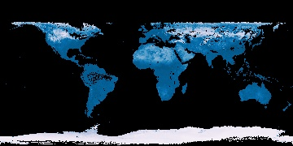
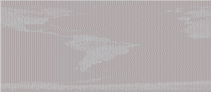
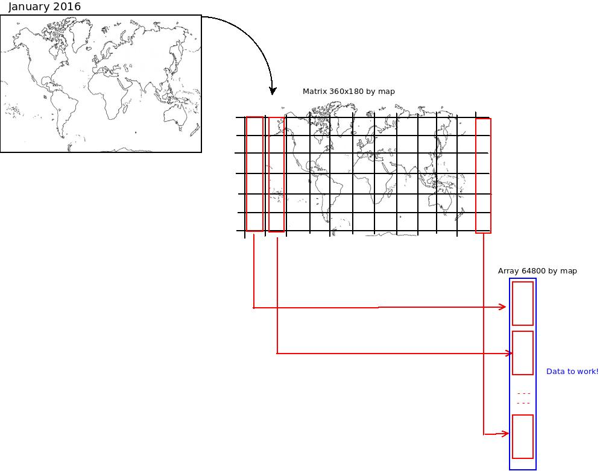
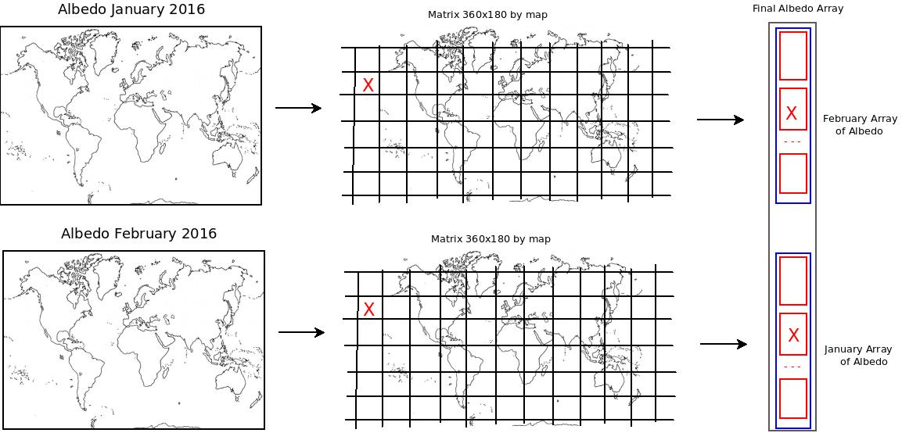
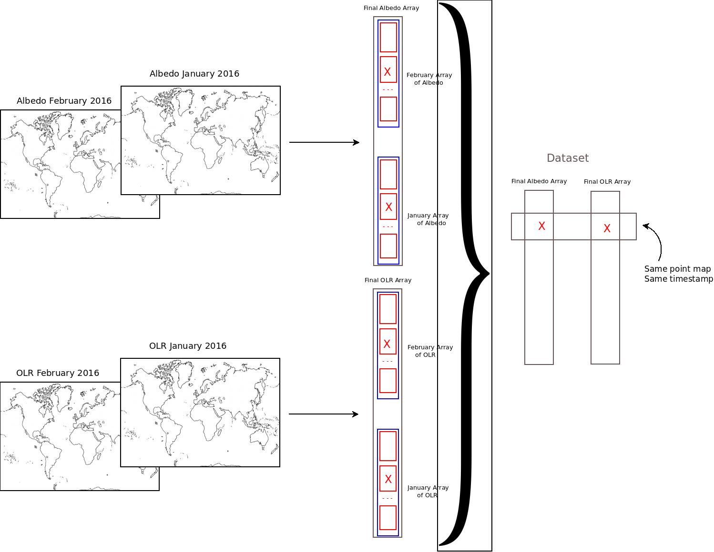

## Data init

The data that we will use is based on images. To be able to use them, we need to obtain a matrix like version of the data, with each pixel representing a point in the world map.

For this particular example we are going to study the level of Albedo. When sunlight reaches the Earth’s surface, some of it is absorbed and some is reflected. The relative amount (ratio) of light that a surface reflects compared to the total sunlight that falls on it is called albedo. Surfaces that reflect a lot of the light falling on them are bright, and they have a high albedo. Surfaces that don’t reflect much light are dark, and they have a low albedo. Snow has a high a albedo, and forests have a low albedo.

We are going to check if the Albedo has relation with other images that we have about Outgoing Longwave Radiation (OLR). Light energy travels in waves, but not all waves are the same. The kind of light our eyes can see is only a tiny part of the energy that exists in the universe. Other kinds of energy are invisible, like the energy that makes our hands feel warm when we hold them over a fire, or the energy that cooks our food in the microwave. When Earth absorbs sunlight, it heats up. The heat, or "outgoing longwave radiation," radiates back into space. Satellites measure this radiation as it leaves the top of Earth's atmosphere. The hotter a place is, the more energy it radiates.

For example, we have this map in jpeg:

And we will work with a csv that looks like:

For this example, we will use the 360x180 matrix data to represent the data (Map with scale 1 degree)

## The Data approach

If we represent the image as a matrix with the values of the Albedo and OLR for the same period of time we can transform these two-dimensional arrays into linear arrays to compare at each geographical point in a specific point of time the values of Albedo and ORL. Keep in mind that by doing this 2D -> 1D transformation, we are losing locality for the different data point, although we won't need it for our use case.

After the initial transformation we obtain one array of 64800 values of VarX (Albedo for example) for each map. The next obstacle for data correlation is that we have one map for each month, but since we are doing variable correlation as independent values we will join consecutive months. Once again, we lose some context when doing this transformation, so the resulting data would not be valid for any kind of time-oriented analysis for example.

On this way we can manipulate the maps in time as variables to correlate. Since the maps are equal, we will be evaluating the same point of the map at the same moment for each of the different variables.

In this way we can try to find correlations between different variables!

## The case study

Then when we have the final dataset to work we try to:

1. Donwload all data from source to work
2. Transform the data matrix to generate the final dataset
3. Find correlation between Albedo and OLR
4. Donwload data about water Vapor and try to find a model to define relation Albedo+OLR=Vapor Water
5. Make a forecast about Albedo and OLR for next month and apply the model to predict of vapor water

